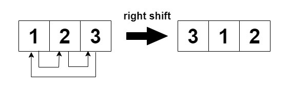

            
# 2946. Matrix Similarity After Cyclic Shifts

You are given an m x n integer matrix mat and an integer k. The matrix rows are 0-indexed.

The following proccess happens k times:

Even-indexed rows (0, 2, 4, ...) are cyclically shifted to the left.


Odd-indexed rows (1, 3, 5, ...) are cyclically shifted to the right.



Return true if the final modified matrix after k steps is identical to the original matrix, and false otherwise.

 

> **Example 1**
> 
> Input: mat = [[1,2,3],[4,5,6],[7,8,9]], k = 4
> 
> Output: false
> 
> Explanation:
> 
> In each step left shift is applied to rows 0 and 2 (even indices), and right shift to row 1 (odd index).
>
> 


> **Example 2**
> 
> Input: mat = [[1,2,1,2],[5,5,5,5],[6,3,6,3]], k = 2
> 
> Output: true
> 
> Explanation:
>
> 


> **Example 3**
> 
> Input: mat = [[2,2],[2,2]], k = 3
> 
> Output: true
> 
> Explanation:
> 
> As all the values are equal in the matrix, even after performing cyclic shifts the matrix will remain the same.


### Solution


```cpp
class Solution {
public:
    bool areSimilar(vector<vector<int>>& mat, int k) {
        int n = mat[0].size();
        k %= n;

        for (const auto& row : mat) {
            for (int j = 0; j < n; ++j) {
                if (row[j] != row[(j + k) % n]) {
                    return false;
                }
            }
        }
        return true;
    }
};
```

Cycle을 생성하는지 index를 순회하면서 탐색한 후에 체크하는거.

이 문제의 경우 각 행이 Cycle이 언제탄생하는지 주기를 파악하면된다.

주기의 최소공배수 문제라고 생각할 수도 있는데, Runtime에 체크만해주면 되는 문제다. 

최대공약수나 최소공배수를 구하는 알고리즘에 대해서는 따로 다루자