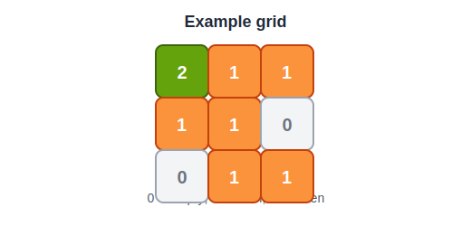

# 994. Rotting Oranges

You are given an m x n grid where each cell can have one of three values:

0 representing an empty cell,
1 representing a fresh orange, or
2 representing a rotten orange.
Every minute, any fresh orange that is 4-directionally adjacent to a rotten orange becomes rotten.

Return the minimum number of minutes that must elapse until no cell has a fresh orange. If this is impossible, return -1.

 

> **Example 1** 
> 
> 
> 
> Input: grid = [[2,1,1],[1,1,0],[0,1,1]]
> Output: 4


> **Example 2**
> 
> Input: grid = [[2,1,1],[0,1,1],[1,0,1]]
> Output: -1
> Explanation: The orange in the bottom left corner (row 2, column 0) is never rotten, because rotting only happens 4-directionally.


> **Example 3**
> 
> Input: grid = [[0,2]]
> Output: 0
> Explanation: Since there are already no fresh oranges at minute 0, the answer is just 0.


### Solution (Failed)

```cpp
class Solution {
public:
int cnt =0;
    int orangesRotting(vector<vector<int>>& grid) {
        int row = grid.size();
        int col = grid[0].size();
        vector<vector<bool>> visited(row, vector<bool>(col, true));
        
        int curx = 0;
        int cury = 0;
        //반복문 (언제까지? -> curx 와 cury가 row,col일때까지) 
        while(curx!=row && cury!=col){
            tuple<int,int> temp;
            rot(grid,row,col,curx,cury);
            temp = check(grid,visited,row,col,curx,cury);
            if(!visited[get<0>(temp)][get<1>(temp)]){
                curx = get<0>(temp);
                cury = get<1>(temp);
            }
            
        }
        return cnt;


    }
    void rot(vector<vector<int>>& grid,int row,int col, int curx, int cury){
        grid[curx][cury]++;
        if(curx-1 > -1 ) grid[curx-1][cury]++;
        if(curx+1 < row) grid[curx+1][cury]++;
        if(cury-1 > -1 ) grid[curx][cury-1]++;
        if(cury+1 < col) grid[curx][cury+1]++;
        cnt++;
    }
    tuple<int,int> check(vector<vector<int>>& grid,vector<vector<bool>>& visited,int row,int col ,int curx, int cury){
        if(curx+1 < row && grid[curx+1][cury]>=2){
            visited[curx+1][cury] = true;
            return make_tuple(curx+1,cury);
        } 
        if(cury+1 < col && grid[curx][cury+1]>=2){
            visited[curx+1][cury] = true;
            return make_tuple(curx,cury+1);
        } 
        if(curx-1 > -1  && grid[curx-1][cury]>=2){
            visited[curx+1][cury] = true;
            return make_tuple(curx-1,cury);
        } 
        if(cury-1 > -1 && grid[curx][cury+1]>=2){
            visited[curx+1][cury] = true;
            return make_tuple(curx,cury-1);
        } 
        return make_tuple(curx,cury);
    }

};
```

BFS로 풀려고했는데, 40분안에 풀지 못했고, 

로직에서 빠진 부분과 틀린 부분이 있었음.

일단 우선, 매번 rot을 수행했는데, 

주변에 0인 칸도 ++를 수행하고있었음 -> 예외처리 안해줬음

cnt 하는 장소가 잘못됨. 우리는 최종적으로 최적해의 시간을 구하는 것이기 때문

### Solution

```cpp
class Solution {
public:
    int orangesRotting(vector<vector<int>>& grid) {
        int rows = grid.size();
        int cols = grid[0].size();
        queue<pair<int, int>> q; // 좌표 저장용
        int freshOranges = 0; // 신선한 오렌지를 지표로 쓸거임
        for(int i=0; i<rows; i++){
            for(int j=0; j<cols; j++){
                if(grid[i][j]==2) q.push(make_pair(i,j));
                //시작부터 썩어있는 좌표를 queue안에 넣는다.
                //나중에 이 큐를 이용해서 초기 접근할거임.
            }
        }
        // 썩은 오렌지가 없고 신선한 오렌지가 없는 경우
        if (freshOranges == 0) return 0;
        vector<pair<int, int>> directions = {{-1, 0}, {1, 0}, {0, -1}, {0, 1}};
        int minutes = 0;

        //여기까지가 초기 설정 

        while (!q.empty()) {
            int size = q.size();
            bool rotted = false;

            for (int i = 0; i < size; ++i) {
                auto [x, y] = q.front();
                q.pop();

                // 4방향 탐색 // directions 이용해서 깔끔하게 접근하는 방법 외워두기
                for (auto [dx, dy] : directions) {
                    int nx = x + dx;
                    int ny = y + dy;

                    // 유효한 위치인지 확인하고, 신선한 오렌지를 썩게 만듦
                    if (nx >= 0 && ny >= 0 && nx < rows && ny < cols && grid[nx][ny] == 1) {
                        grid[nx][ny] = 2; // 썩음으로 변경
                        q.push({nx, ny}); 
                        freshOranges--;
                        rotted = true;
                    }
                }
            }

            // 만약 썩은 오렌지가 있었다면 시간 증가
            if (rotted) minutes++;
        }

        // 신선한 오렌지가 남아 있다면 -1 반환, 아니면 걸린 시간 반환
        return freshOranges == 0 ? minutes : -1;

    }
};

```

오류 수정 및 큐를 이용한 개선.

우선, 방문벡터는 공간낭비이므로 삭제해준다.

방문 위치를 수정할 필요가 없는 경우에는 필요하겠지만, 여기서는 필요없음.

```cpp
if (nx >= 0 && ny >= 0 && nx < rows && ny < cols && grid[nx][ny] == 1) {
                        grid[nx][ny] = 2; // 썩음으로 변경
                        q.push({nx, ny}); 
                        freshOranges--;
                        rotted = true;
                    }

```

여기서, 다시 q.push해주는 부분이 중요하다. 

만약 썩게될 지점이라면, 큐에 넣어주는 부분.

Time complexity : O(N * M * maxSteps) maxSteps는 해까지 걸리는 시간 

Space complexity : O(N) grid
