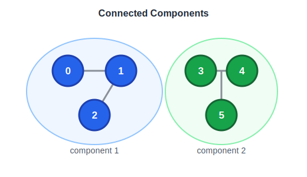

# Connected Component (연결 요소)

그래프에서 서로 연결된 노드들의 집합.  
**Undirected Graph** 에서는 단순 연결 여부, **Directed Graph** 에서는 SCC(강한 연결 요소)로 구분된다.

## 동작 원리 예시



5개 노드, 간선이 0-1, 1-2, 3-4인 그래프 (노드 2와 3 사이는 끊김):

```
0 — 1 — 2     3 — 4
(컴포넌트 A)  (컴포넌트 B)
```

DFS로 컴포넌트 탐색 과정:

```
i=0: visited[0]=false → dfs(0) 시작
     0 방문 → 1 방문 → 2 방문 → 더 갈 곳 없음
     count++ → count=1

i=1: visited[1]=true  → skip
i=2: visited[2]=true  → skip

i=3: visited[3]=false → dfs(3) 시작
     3 방문 → 4 방문 → 더 갈 곳 없음
     count++ → count=2

i=4: visited[4]=true  → skip

결과: 연결 요소 수 = 2
```

방문하지 않은 노드를 발견할 때마다 새로운 컴포넌트가 시작된다.

## 탐색 방법

| 방법 | 설명 |
|------|------|
| BFS/DFS | 방문하지 않은 노드에서 탐색 시작, 탐색마다 컴포넌트 수 +1 |
| Union-Find | 간선을 보며 두 노드를 같은 집합으로 묶음 |

## 코드 템플릿 (C++ - DFS)

```cpp
#include <vector>
#include <functional>
using namespace std;

int countComponents(int n, vector<vector<int>>& edges) {
    vector<vector<int>> graph(n);
    for (auto& e : edges) {
        graph[e[0]].push_back(e[1]);
        graph[e[1]].push_back(e[0]);
    }

    vector<bool> visited(n, false);
    int count = 0;

    function<void(int)> dfs = [&](int node) {
        visited[node] = true;
        for (int neighbor : graph[node]) {
            if (!visited[neighbor]) {
                dfs(neighbor);
            }
        }
    };

    for (int i = 0; i < n; i++) {
        if (!visited[i]) {
            dfs(i);
            count++;
        }
    }

    return count;
}
```

## 특징

- Undirected: BFS/DFS or Union-Find
- Directed: Kosaraju / Tarjan 알고리즘으로 SCC 탐색
- 노드 수 `n`, 간선 수 `e` 일 때 연결 요소 수 최소 1, 최대 n

## Related Problems

- [547. Number of Provinces](547.%20Number%20of%20Provinces.md)
- [200. Number of Islands](200.%20Number%20of%20Islands.md)
- [695. Max Area of Island](695.%20Max%20Area%20of%20Island.md)
- [305. Number of Islands II](305.%20Number%20of%20Islands%20II.md)
