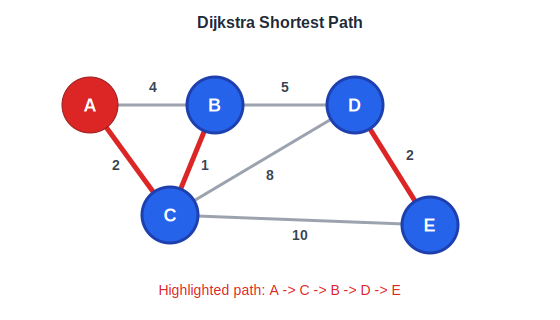

# Minimum Path (최단 경로)

## 동작 원리 예시 (Dijkstra)



A에서 시작해 우선순위 큐로 현재까지의 최소 거리 노드를 꺼내고, 이웃 노드의 거리를 갱신한다. 이미 확정된 노드는 skip(d > dist[u]).

---

## 알고리즘 선택 기준

| 알고리즘 | 가중치 | 음수 간선 | 음수 사이클 | 복잡도 |
|----------|--------|-----------|-------------|--------|
| BFS | 없음(단위) | X | X | O(V+E) |
| Dijkstra | 양수만 | X | X | O((V+E)logV) |
| Bellman-Ford | 있음 | O | 탐지 가능 | O(VE) |
| Floyd-Warshall | 있음 | O | X | O(V³) |

---

## 1. BFS (가중치 없는 그래프)

```cpp
#include <vector>
#include <queue>
using namespace std;

vector<int> bfsDist(int n, vector<vector<int>>& graph, int start) {
    vector<int> dist(n, -1);
    queue<int> q;
    dist[start] = 0;
    q.push(start);

    while (!q.empty()) {
        int u = q.front(); q.pop();
        for (int v : graph[u]) {
            if (dist[v] == -1) {
                dist[v] = dist[u] + 1;
                q.push(v);
            }
        }
    }
    return dist;
}
```

---

## 2. Dijkstra (양수 가중치)

```cpp
#include <vector>
#include <queue>
#include <climits>
using namespace std;

// graph[u] = {{v, weight}, ...}
vector<int> dijkstra(int n, vector<vector<pair<int,int>>>& graph, int start) {
    vector<int> dist(n, INT_MAX);
    priority_queue<pair<int,int>, vector<pair<int,int>>, greater<>> pq;
    dist[start] = 0;
    pq.push({0, start});

    while (!pq.empty()) {
        auto [d, u] = pq.top(); pq.pop();
        if (d > dist[u]) continue;
        for (auto [v, w] : graph[u]) {
            if (dist[u] + w < dist[v]) {
                dist[v] = dist[u] + w;
                pq.push({dist[v], v});
            }
        }
    }
    return dist;
}
```

---

## 3. Bellman-Ford (음수 가중치 허용)

```cpp
#include <vector>
#include <climits>
using namespace std;

// edges = {{u, v, weight}, ...}
vector<int> bellmanFord(int n, vector<tuple<int,int,int>>& edges, int start) {
    vector<int> dist(n, INT_MAX);
    dist[start] = 0;

    for (int i = 0; i < n - 1; i++) {
        for (auto [u, v, w] : edges) {
            if (dist[u] != INT_MAX && dist[u] + w < dist[v])
                dist[v] = dist[u] + w;
        }
    }

    // 음수 사이클 탐지
    for (auto [u, v, w] : edges) {
        if (dist[u] != INT_MAX && dist[u] + w < dist[v])
            return {}; // 음수 사이클 존재
    }
    return dist;
}
```

---

## 4. Floyd-Warshall (모든 쌍 최단 경로)

```cpp
#include <vector>
#include <climits>
using namespace std;

vector<vector<int>> floydWarshall(int n, vector<vector<int>>& adjMatrix) {
    vector<vector<int>> dist = adjMatrix;

    for (int k = 0; k < n; k++)
        for (int i = 0; i < n; i++)
            for (int j = 0; j < n; j++)
                if (dist[i][k] != INT_MAX && dist[k][j] != INT_MAX)
                    dist[i][j] = min(dist[i][j], dist[i][k] + dist[k][j]);

    return dist;
}
```

---

## 관련 알고리즘

- [BFS](BFS.md)
- [DAG](DAG.md) — DP를 이용한 DAG 최단/최장 경로
- [MST](MST.md)

## Related Problems

- [909. Snakes and Ladders](909.%20Snakes%20and%20Ladders.md)
- [2359. Find Closest Node to Given Two Nodes](2359.%20Find%20Closest%20Node%20to%20Given%20Two%20Nodes.md)
