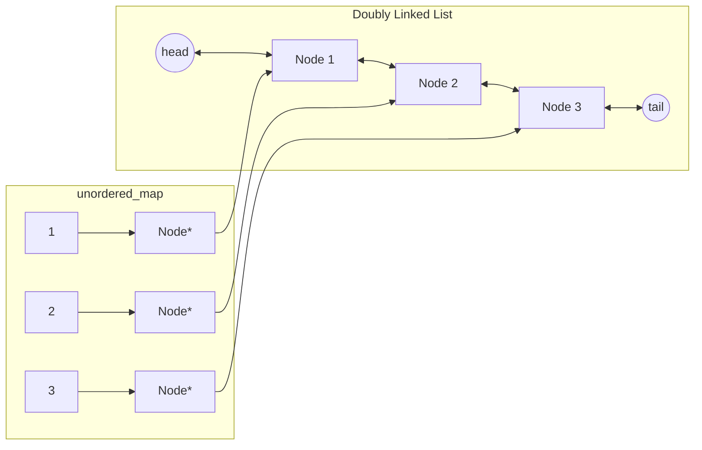

# 146. LRU Cache

Design a data structure that follows the constraints of a Least Recently Used (LRU) cache.

Implement the LRUCache class:

LRUCache(int capacity) Initialize the LRU cache with positive size capacity.
int get(int key) Return the value of the key if the key exists, otherwise return -1.
void put(int key, int value) Update the value of the key if the key exists. Otherwise, add the key-value pair to the cache. If the number of keys exceeds the capacity from this operation, evict the least recently used key.
The functions get and put must each run in O(1) average time complexity.

 

> **Example 1**
> 
> Input
> 
> ["LRUCache", "put", "put", "get", "put", "get", "put", "get", "get", "get"]
> 
> [[2], [1, 1], [2, 2], [1], [3, 3], [2], [4, 4], [1], [3], [4]]
> 
> Output
> 
> [null, null, null, 1, null, -1, null, -1, 3, 4]
> 
> Explanation
> 
> LRUCache lRUCache = new LRUCache(2);
> 
> lRUCache.put(1, 1); // cache is {1=1}
> 
> lRUCache.put(2, 2); // cache is {1=1, 2=2}
> 
> lRUCache.get(1);    // return 1
> 
> lRUCache.put(3, 3); // LRU key was 2, evicts key 2, cache is {1=1, 3=3}
> 
> lRUCache.get(2);    // returns -1 (not found)
> 
> lRUCache.put(4, 4); // LRU key was 1, evicts key 1, cache is {4=4, 3=3}
> 
> lRUCache.get(1);    // return -1 (not found)
> 
> lRUCache.get(3);    // return 3
> 
> lRUCache.get(4);    // return 4


진행되는 사고의 흐름은 다음과 같음

### 1. get() 과 put()을 O(1)안에 만족시켜야 한다 -> hash map

### 2. 가장 오래된 원소임을 알 수 있어야한다 -> index 정보 필요 
   1) array, vector : put() 사용 시 O(N) 시간이 걸리게되므로 후보 탈락. (이 문제에서는 최근 사용한 원소에 대해서는 순서이동을 수행해줘야 하므로)
   2) queue, deque : 중간 node를 삭제 시 O(N), 앞/뒤 삭제 O(1) 이므로 후보 탈락
   3) Linked List : 중간 node 삭제, 앞/뒤 삭제 O(1) 이므로 만족.

### 3. 어떤 Linked List를 써야할지?
   1) Singly Linked List : 맨 앞 삭제 O(1), 맨 뒤 삭제 O(N) -> O(1) (tail ptr 만들어서 사용 시), 중간 node 삭제 O(N) (Target node의 이전 node를 알고있다면 O(1))
   2) Doubly Lined List : 맨 앞 삭제 O(1), 맨 뒤 삭제 O(1), 중간 node 삭제 O(1) (Target node ptr을 알고있다면)

결국, 아래와 같은 구조로 구성하면 된다. 



### 4. 사용될 Node의 구현

    ```cpp
    class Node{
    public:
        int key;
        int value;
        Node* prev;
        Node* next;

        Node(int key, int value); //선언과 구현 별도
    };
    Node::Node(int k, int v){
        key = k;
        value = v;
        prev = nullptr;
        next = nullptr;
    }
    ```

### 5. LRU Cache 의 class member 만들기

    ```cpp
    class LRUCache {
    private:
        int capacity;
        unordered_map<int, Node*> um;
        Node* head; 
        // head와 tail은 고정이니 어차피 Node가 아니라 
        // LRUCache 쪽에서 갖고있는 편이 나음.
        Node* tail;
        void remove(Node* node);
        void add(Node* node);
    public:
        LRUCache(int capacity);
        ~LRUCache(); //소멸자를 항상 신경써주자

        int get(int key); 
        void put(int key, int value);
        // 위 두 함수는 Interface이므로 public 구성
    };
    ```
    
여기서, unordered_map의 value로 쓰일 Node는 값 복사되지 않게 
Node*로 해주는 것이 중요하다. (8bytes in 64 bit OS)


### 6. 세부 함수 구현 (LRU Cache)

    ```cpp
    LRUCache::LRUCache(int c) {
        capacity = c;

        head = new Node(0, 0); //dummy
        tail = new Node(0, 0); //dummy

        head->next = tail;
        tail->prev = head;
    }

    LRUCache::~LRUCache(){
        Node* current = head;
        while(current){
            Node* nextNode = current->next;
            delete current;
            current = nextNode;
        }
        // head부터 시작해서, tail 까지 순회하며 계속 current ptr을 지워주기.
    }

    void LRUCache::remove(Node* node){
        Node* p = node->prev; //이거 복사생성자라서 새로운 p를 만드는거아닌가? -> 아님, 포인터만 복사 
        Node* n = node->next;
        p->next = n;
        n->prev = p;
    }

    void LRUCache::add(Node* node){//맨 뒤에 있는애가 제일 최신이라고 가정 
        Node* prevTail = tail->prev;
        prevTail->next = node;
        node->prev = prevTail;
        node->next = tail;
        tail->prev = node;
    }

    int LRUCache::get(int key) {
        auto it = um.find(key);
        if(it==um.end()) return -1;
        Node* node = it->second; // it는 Node * type이고, class type 객체의 pointer 이므로 ->를 통해서 원소접근해야함.
        remove(node); 
        add(node);
        //위 두 줄에서 remove & add 를 해주는 이유는, Linked List 상 순서를 갱신해주기 위함임. (Recently used)
        return node->value;
    }

    void LRUCache::put(int k, int v) {
        auto it = um.find(k);

        if(it!=um.end()) {
            Node* node = it->second;
            it->second->value = v;
            remove(node);
            add(node);
            return;
        }

        Node* node = new Node(k, v);
        um[k] = node;
        add(node);

        // 아래가 몹시 중요한 부분임!
        if(um.size() > capacity){
            Node* lru = head->next; /*아래에 따라올 remove를 하게 되면, 구조가 변경되게되므로, 만약 lru를 선언해서 사용하지 않고 remove(head->next); 이후 um.erase(head->next->key)를 수행할 경우, 호출되는 head->next가 다르므로 문제가 발생 가능하다. 그래서, 현재 head->next 를 lru 선언을 통해 고정된 주소값을 얻고나서 수행해야함 */
            remove(lru);
            um.erase(lru->key);
            /*remove와 erase를 따로 수행해주는 이유
            remove : Linked List의 연결성 해제
            erase : unordered_map에 있는 key:value 쌍 삭제 
            용도이므로 따로 수행되어야 한다.*/
            delete lru; // 쓸모없어진 포인터 삭제로 뒷정리
        }
    }
    ```


### Solution (전체 코드)
```cpp
#include <unordered_map>
using namespace std;

class Node{
public:
    int key;
    int value;
    Node* prev;
    Node* next;

    Node(int key, int value); //선언과 구현 별도로
};

Node::Node(int k, int v){
    key = k;
    value = v;
    prev = nullptr;
    next = nullptr;
}

class LRUCache {
private:
    int capacity;
    unordered_map<int, Node*> um;
    Node* head;
    Node* tail;

    void remove(Node* node);
    void add(Node* node);

public:
    LRUCache(int capacity);
    ~LRUCache();

    int get(int key);
    void put(int key, int value);
};

LRUCache::LRUCache(int c) {
    capacity = c;

    head = new Node(0, 0); // 더미 헤드
    tail = new Node(0, 0); // 더미 테일

    head->next = tail;
    tail->prev = head;
}

LRUCache::~LRUCache(){
    // 소멸자를 써주면 좋다
    Node* current = head;
    while(current){
        Node* nextNode = current->next;
        delete current;
        current = nextNode;
    }
}

void LRUCache::remove(Node* node){
    Node* p = node->prev; //이거 복사생성자라서 새로운 p를 만드는거아닌가? -> 아님, 포인터만 복사 
    Node* n = node->next;
    p->next = n;
    n->prev = p;
}

void LRUCache::add(Node* node){//맨 뒤에 있는애가 제일 최신이라고 가정 
    Node* prevTail = tail->prev;
    prevTail->next = node;
    node->prev = prevTail;
    node->next = tail;
    tail->prev = node;
}

int LRUCache::get(int key) {
    auto it = um.find(key);
    if(it==um.end()) return -1;
    Node* node = it->second; //iterator.second 하면 value나옴. 그리고 -> 인거 중요
    //사용했던 기록을 남기기위해서 노드의 뒤로 이동해주자
    remove(node);
    add(node);
    return node->value;
}

void LRUCache::put(int k, int v) {
    auto it = um.find(k);

    if(it!=um.end()) {
        Node* node = it->second;
        it->second->value = v;

        //마찬가지로 갱신
        remove(node);
        add(node);
        return;
    }

    Node* node = new Node(k, v);
    um[k] = node;
    add(node);

    if(um.size() > capacity){
        Node* lru = head->next;
        remove(lru);
        um.erase(lru->key);
        delete lru;
    }
}
```